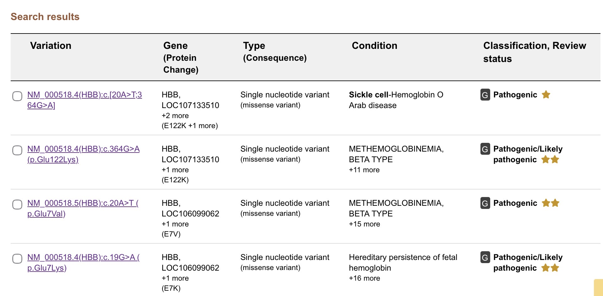
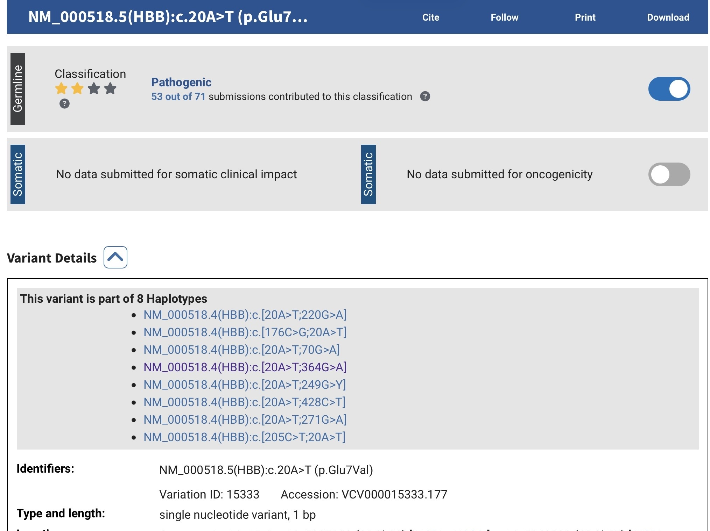

# Mutation Analysis Using ClinVar

## 📌 Overview
This project explores genetic variant interpretation using the ClinVar database to investigate the clinical significance of mutations in the human HBB gene.

## 🔬 Method
- Used the ClinVar database
- Searched for variants associated with the HBB gene
- Reviewed variant classification and molecular consequences
- Selected one variant for detailed interpretation

## 📊 Key Findings
- Multiple HBB variants with different clinical classifications were identified
- The selected variant, NM_000518.5(HBB):c.20A>T (p.Glu7Val), was classified as pathogenic
- The mutation results in substitution of glutamic acid with valine in the protein sequence

## 🧠 Biological Interpretation
This project demonstrates how single nucleotide changes may influence protein sequence and biological outcomes. It also highlights the importance of integrating variant classification, molecular consequence, and supporting clinical evidence during interpretation.

## 🛠 Skills Demonstrated
- Mutation analysis
- Variant interpretation
- Clinical database usage
- Understanding genotype–protein relationships
- Bioinformatics data interpretation

## 📁 Project Files
- PDF report with detailed analysis
- ClinVar screenshots

## 📸 ClinVar Output

